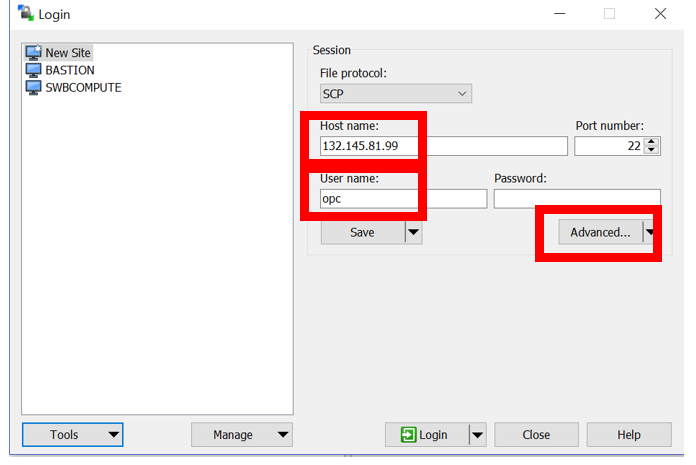
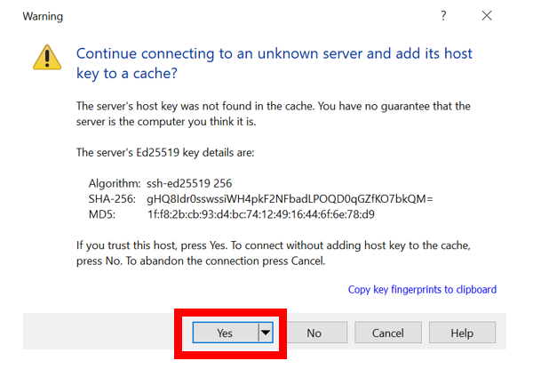

# Copy SSH Key and Wallet #

## Introduction

Now we need to copy the ATP Wallet to our application server so it can connect to ATP. We can’t access the compute App Server directly because it’s in the private subnet. So we’ll need to go through the Bastion, the "jump" server.

Estimated Time: 30 minute

### Objectives

* copy ssh key and wallet to application for ATP connectivity

### Prerequisites

- Web browser
- PuTTy or equivalent
- WinSCP or equivalent
- Wallet
- SSH keys

## Task 1: Copy the ATP Wallet ##

1. Locate the ATP Wallet on your laptop. You downloaded it when you created ATP.
2. Connect WinSCP or equivalent to the Bastion. You will need the public IP address and the private key for the Bastion. The public IP is in your compute details. Navigate there to get it. The user is **opc,** no password**.**
3. Use WinSCP or equivalent to copy the ATP wallet to the Bastion. You can just put it on the Bastion compute home directory.
4. Copy also the SSH private key for the App Server to the Bastion. Be sure to copy the key for Linux, not the .ppk, because your App Server is a Linux compute.


​	5. From WinSCP or equivalent, enter the public IP address of the Bastion in the Host name

​	6. Enter **opc** for the user name

​	7. Click Advanced to select the private SSH key



​	8. Select Authentication

 9. Browse for the private SSH key
 

 

​	10. Click Yes

​	11. Copy both the ATP wallet and the private SSH key for the App Server to the Bastion. Be sure to copy the key for Linux, not the .ppk, because your app server is a Linux compute.


## Task 2: Copy the ATP Wallet to the App Server ##


We are now going to copy the ATP Wallet to the App Server. The App Server will be running a workload against the ATP database and will need the wallet to connect to it later. Only the Bastion can reach the private compute (your App Server). The Bastion can connect to the private IP address because they are in the same VCN.

1. Get the **private** IP address of your App Server from the compute details
2. Ssh to the Bastion with PuTTy or your ssh client

From Bastion session:

```
$ ls –al
```

​	3. Restrict the permissions of labkey or your own key

```
$ chmod 0700 labkey
```

​	4. Copy your ATP wallet from the Bastion to the App Server

(Replace the below commands with your SSH private key, wallet name, and private IP address of your App Server)

```
$ scp -C -i labkey -r Wallet_ATPLABTEST.zip opc@10.0.1.2:/home/opc
```

 5. Type **yes** if you see the message below:

    


Connect to App Server with the private key. Replace the private key and private IP address with yours.

```
$ ssh –i labkey opc@10.0.1.2

$ ls
```

Let’s test you can reach the internet through the NAT gateway, ping something like the Google DNS. We will need to install software from the internet through the NAT later.

From the App Server session

```
$ ping 8.8.8.8
```


You may now proceed to the next lab.

## Acknowledgements ##

- **Author** - Milton Wan, Satyabrata Mishra Database Product Management, August 2021
